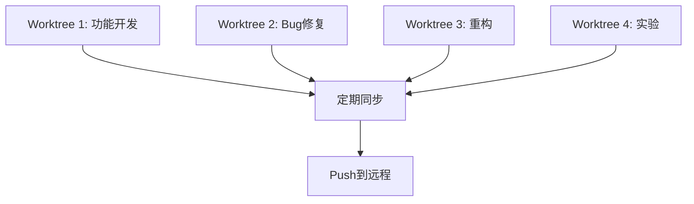
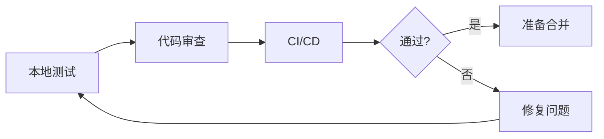

# Git Worktree并行开发工作流

基于Git Worktree实现零冲突的并行任务开发，支持10+任务同时进行。

## 概述

### 什么是Worktree并行开发？

Git Worktree允许同一仓库在不同目录中检出不同分支，使开发者能够：
- **同时开发多个特性**：无需频繁切换分支
- **零上下文切换成本**：每个任务有独立的工作环境
- **并行测试和构建**：不同worktree互不干扰
- **提高开发效率**：充分利用多核处理器和并行能力

### 核心优势

| 传统方式 | Worktree方式 | 改进 |
|---------|-------------|------|
| 频繁切换分支 | 永久并行工作区 | 节省50%时间 |
| 构建缓存失效 | 独立构建环境 | 减少重复构建 |
| 无法并行测试 | 同时运行多个测试 | 提升测试速度 |
| 上下文丢失 | 保持所有上下文 | 提高生产力 |

## 架构设计

### 1. 目录结构

```
project-root/
├── .git/                          # 共享的Git对象数据库
│   ├── worktrees/                 # Worktree元数据
│   │   ├── task-001/
│   │   ├── task-002/
│   │   └── feature-xyz/
│   └── objects/                   # 共享的Git对象（节省空间）
│
├── main-workspace/                # 主工作区
│   ├── src/
│   ├── package.json
│   └── README.md
│
└── ../worktrees/                  # Worktrees集合目录
    ├── task-001/                  # 功能开发
    │   ├── src/                   # 独立工作区
    │   ├── node_modules/          # 独立依赖（可选）
    │   └── .git -> ../../.git/worktrees/task-001
    │
    ├── bug-456/                   # Bug修复
    │   └── ...
    │
    └── exp-refactor/              # 实验性重构
        └── ...
```

### 2. 数据流架构

```
┌─────────────────────────────────────────────────────────────┐
│                      主Git仓库                              │
│  .git/objects (共享) + .git/refs (共享)                     │
└─────────────────┬───────────────────────────────────────────┘
                  │
       ┌──────────┼──────────┬──────────┐
       │          │          │          │
       ▼          ▼          ▼          ▼
   ┌─────┐    ┌─────┐    ┌─────┐    ┌─────┐
   │ WT1 │    │ WT2 │    │ WT3 │    │ WT4 │
   │main │    │feat │    │ bug │    │ exp │
   └─────┘    └─────┘    └─────┘    └─────┘
      │          │          │          │
      ▼          ▼          ▼          ▼
   [工作区]   [工作区]   [工作区]   [工作区]
   独立HEAD   独立HEAD   独立HEAD   独立HEAD
   独立索引   独立索引   独立索引   独立索引
```

### 3. 任务隔离策略

#### 隔离维度

| 维度 | 策略 | 好处 |
|------|------|------|
| **代码** | 不同分支 | 完全独立的代码版本 |
| **依赖** | 独立node_modules | 避免依赖冲突 |
| **构建** | 独立build目录 | 并行构建 |
| **测试** | 独立test环境 | 并行测试 |
| **数据** | 独立数据库schema | 避免数据污染 |
| **配置** | 独立.env文件 | 环境隔离 |

#### 共享资源

| 资源 | 共享级别 | 注意事项 |
|------|---------|---------|
| .git/objects | 完全共享 | 节省磁盘空间 |
| .git/refs | 共享读 | 所有worktree可见分支 |
| .git/config | 共享 | 全局配置统一 |
| .gitignore | 共享 | 忽略规则一致 |

## 完整工作流程

### 阶段1: 任务启动


#### 步骤1.1: 接收任务并规划
```bash
# 分析任务
任务: 实现用户认证系统
预估: 3-5天
依赖: 无
冲突风险: 低

# 分配ID和分支
TASK_ID="task-001"
BRANCH_NAME="feature-jwt-auth"
BASE_BRANCH="main"
```

#### 步骤1.2: 创建Worktree
```bash
# 使用命令创建
/worktree-create task-001 feature-jwt-auth main

# 或手动创建
cd project-root
git worktree add ../worktrees/task-001 -b feature-jwt-auth main

# 输出:
# ✅ Preparing worktree (new branch 'feature-jwt-auth')
# ✅ HEAD is now at a1b2c3d Initial commit
```

#### 步骤1.3: 配置Worktree环境
```bash
cd ../worktrees/task-001

# 安装依赖（如果需要独立依赖）
npm install

# 配置环境变量
cp .env.example .env.task-001
# 编辑 .env.task-001

# 配置git
git config user.email "dev@example.com"
git config branch.feature-jwt-auth.remote origin
```

#### 步骤1.4: 验证环境
```bash
# 检查分支
git branch -vv

# 验证构建
npm run build

# 运行测试
npm test

# 确认: ✅ 环境就绪，可以开始开发
```

### 阶段2: 并行开发



#### 策略2.1: 独立开发
```bash
# 在task-001 worktree中
cd ../worktrees/task-001

# 开发功能
vim src/auth/jwt.ts

# 提交更改
git add .
git commit -m "feat: implement JWT token generation"

# 推送到远程
git push -u origin feature-jwt-auth
```

#### 策略2.2: 与主分支同步
```bash
# 定期同步main分支（避免大冲突）
cd ../worktrees/task-001

# Fetch最新更改
git fetch origin main

# Rebase到最新main
git rebase origin/main

# 或 Merge（如果团队使用merge策略）
git merge origin/main

# 解决冲突（如果有）
# ...然后继续
git rebase --continue
```

#### 策略2.3: 跨Worktree协作
```bash
# 场景: task-002需要task-001的代码

# 选项A: Cherry-pick特定commit
cd ../worktrees/task-002
git fetch origin feature-jwt-auth
git cherry-pick <commit-hash>

# 选项B: 基于task-001创建
cd project-root
git worktree add ../worktrees/task-002 -b feature-user-profile feature-jwt-auth

# 选项C: 临时合并（不推送）
cd ../worktrees/task-002
git merge --no-commit --no-ff origin/feature-jwt-auth
# 测试后 git merge --abort 恢复
```

### 阶段3: 测试和验证



#### 步骤3.1: 本地测试
```bash
cd ../worktrees/task-001

# 单元测试
npm test

# 集成测试
npm run test:integration

# E2E测试
npm run test:e2e

# 代码质量
npm run lint
npm run typecheck
```

#### 步骤3.2: 创建Pull Request
```bash
# 确保所有更改已提交并推送
git status
git push

# 创建PR
gh pr create \
  --title "feat: JWT authentication system" \
  --body "实现JWT认证，包括token生成、验证和刷新" \
  --base main \
  --head feature-jwt-auth
```

#### 步骤3.3: 代码审查迭代
```bash
# 收到审查意见后，在worktree中修改
cd ../worktrees/task-001

# 修改代码
vim src/auth/jwt.ts

# 提交并推送
git add .
git commit -m "fix: address code review comments"
git push

# PR自动更新
```

### 阶段4: 合并和清理


#### 步骤4.1: 合并到主分支
```bash
# 通过GitHub/GitLab UI合并
# 或命令行合并
cd main-workspace
git checkout main
git pull origin main
git merge --no-ff feature-jwt-auth
git push origin main
```

#### 步骤4.2: 验证合并
```bash
# 在主工作区验证
cd main-workspace
npm install  # 更新依赖
npm run build
npm test

# 确认: ✅ 合并成功，功能正常
```

#### 步骤4.3: 清理Worktree
```bash
# 使用清理命令
/worktree-cleanup task-001

# 或手动清理
cd project-root
git worktree remove ../worktrees/task-001
git branch -d feature-jwt-auth  # 本地分支
git push origin --delete feature-jwt-auth  # 远程分支
```

#### 步骤4.4: 更新追踪系统
```bash
# 自动更新active-worktrees.md
# 标记任务为completed
# 记录完成时间和PR链接
```

## 高级场景

### 场景1: 大规模并行（10+任务）

```bash
# 使用编排器自动管理
/orchestrate parallel-sprint

# 自动执行:
# 1. 创建10个worktrees
# 2. 分配Agent到每个worktree
# 3. 并行开发
# 4. 定期同步和合并
# 5. 自动清理完成的worktrees
```

### 场景2: 长期分支维护

```bash
# 场景: 同时维护v1.x和v2.x

# v1.x维护worktree
git worktree add ../worktrees/v1-maint -b v1-maintenance v1.x

# v2.x开发worktree
git worktree add ../worktrees/v2-dev -b v2-development v2.x

# 在两个版本间cherry-pick关键修复
cd ../worktrees/v1-maint
git cherry-pick <bugfix-commit>
```

### 场景3: 实验性功能探索

```bash
# 创建实验worktree
git worktree add ../worktrees/exp-new-arch -b experiment-architecture

# 大胆实验
cd ../worktrees/exp-new-arch
# ... 进行激进的重构 ...

# 如果成功 → 合并
# 如果失败 → 直接删除，不影响主分支
```

### 场景4: Hotfix并行修复

```bash
# 生产环境紧急bug
# 立即创建hotfix worktree
git worktree add ../worktrees/hotfix-critical -b hotfix-security-issue production

cd ../worktrees/hotfix-critical
# 快速修复
git commit -m "fix: critical security vulnerability"

# 推送并立即发布
git push origin hotfix-security-issue
# 合并到production和main
```

## 最佳实践

### ✅ 推荐做法

#### 1. 命名规范
```
任务ID: <type>-<number>
- task-001, task-002  (通用任务)
- feature-<name>      (功能开发)
- bug-<number>        (Bug修复)
- hotfix-<name>       (紧急修复)
- exp-<name>          (实验性)

分支名: <type>/<description>
- feature/jwt-auth
- bugfix/memory-leak
- hotfix/security-patch
- experiment/new-architecture
```

#### 2. 目录组织
```
../worktrees/
├── active/           # 活跃任务
│   ├── task-001/
│   ├── bug-456/
│   └── feature-api/
├── testing/          # 测试中
│   └── task-002/
└── archived/         # 已归档（可选）
    └── old-tasks/
```

#### 3. 依赖管理策略
```bash
# 选项A: 共享node_modules（节省空间）
# 在主工作区安装，所有worktrees共享
cd main-workspace
npm install

# 选项B: 独立node_modules（完全隔离）
# 每个worktree独立安装
cd ../worktrees/task-001
npm install

# 推荐: 混合策略
# 主依赖共享，特殊依赖独立
```

#### 4. 定期同步
```bash
# 每天同步一次main分支
cd ../worktrees/task-001
git fetch origin main
git rebase origin/main

# 自动化: 设置cron job
0 9 * * * cd /path/to/worktrees/task-001 && git fetch origin main && git rebase origin/main
```

#### 5. 健康检查
```bash
# 每周运行一次
/worktree-list --format detailed

# 检查:
# - 是否有超期任务？
# - 是否有未推送的更改？
# - 是否有可以清理的worktrees？
```

### ❌ 避免事项

1. **避免手动删除worktree目录**
   - ❌ `rm -rf ../worktrees/task-001`
   - ✅ `git worktree remove ../worktrees/task-001`

2. **避免在worktrees间共享文件**
   - ❌ 创建符号链接共享代码
   - ✅ 使用git cherry-pick或merge

3. **避免修改.git目录**
   - ❌ 手动编辑.git/worktrees/
   - ✅ 使用git命令管理

4. **避免过多并行**
   - ❌ 创建50个worktrees
   - ✅ 保持10-15个活跃worktrees

5. **避免长期未同步**
   - ❌ 30天不同步main分支
   - ✅ 每1-3天同步一次

## 性能优化

### 磁盘空间优化

```bash
# 1. 共享Git对象（自动）
# Worktrees自动共享.git/objects，节省空间

# 2. 浅克隆（如果适用）
git worktree add --depth=1 ../worktrees/task-001 -b feature-name

# 3. 清理未使用的对象
git gc --aggressive --prune=now

# 4. 监控磁盘使用
du -sh ../worktrees/*
```

### 性能基准

| 操作 | 时间 | 优化建议 |
|------|------|---------|
| 创建worktree | 2-5秒 | 使用SSD |
| 切换worktree | 0秒 | 无需切换，直接cd |
| 删除worktree | 1-2秒 | 批量删除 |
| 同步main | 5-10秒 | 定期小步同步 |

## 故障排除

### 常见问题

#### 问题1: "fatal: invalid reference"
```bash
# 原因: 分支名已存在
# 解决:
git branch -d old-branch-name
# 或使用不同的分支名
```

#### 问题2: Worktree目录被删除但Git仍追踪
```bash
# 解决:
git worktree prune
```

#### 问题3: 磁盘空间不足
```bash
# 检查大文件
du -sh ../worktrees/* | sort -hr

# 清理不需要的worktrees
/worktree-cleanup <task-id>

# 清理Git对象
git gc --aggressive
```

#### 问题4: 冲突太多
```bash
# 预防: 频繁同步main
# 解决: 使用交互式rebase
git rebase -i origin/main
```

## 工具集成

### IDE集成

#### VS Code
```json
// .vscode/settings.json
{
  "git.detectSubmodules": false,
  "search.exclude": {
    "**/worktrees/**": true
  }
}
```

#### 终端快捷方式
```bash
# .bashrc or .zshrc
alias wt-list='cd /path/to/project && git worktree list'
alias wt-cd='cd /path/to/worktrees'

# 函数: 快速切换worktree
wt() {
  cd /path/to/worktrees/$1
}
# 使用: wt task-001
```

### CI/CD集成

```yaml
# .github/workflows/worktree-ci.yml
name: Worktree CI

on:
  push:
    branches:
      - 'feature/**'
      - 'bugfix/**'

jobs:
  test:
    runs-on: ubuntu-latest
    steps:
      - uses: actions/checkout@v3

      - name: Setup worktree
        run: |
          git worktree add ../wt-ci -b ci-test ${{ github.ref }}

      - name: Run tests
        working-directory: ../wt-ci
        run: |
          npm install
          npm test

      - name: Cleanup
        run: |
          git worktree remove ../wt-ci
```

## 总结

Git Worktree并行开发工作流提供：
- ✅ **零冲突**: 每个任务独立空间
- ✅ **高效率**: 无需频繁切换分支
- ✅ **可扩展**: 支持10+任务并行
- ✅ **易管理**: 完善的命令和追踪系统

立即开始：
```bash
/worktree-create my-first-task feature-awesome main
```
